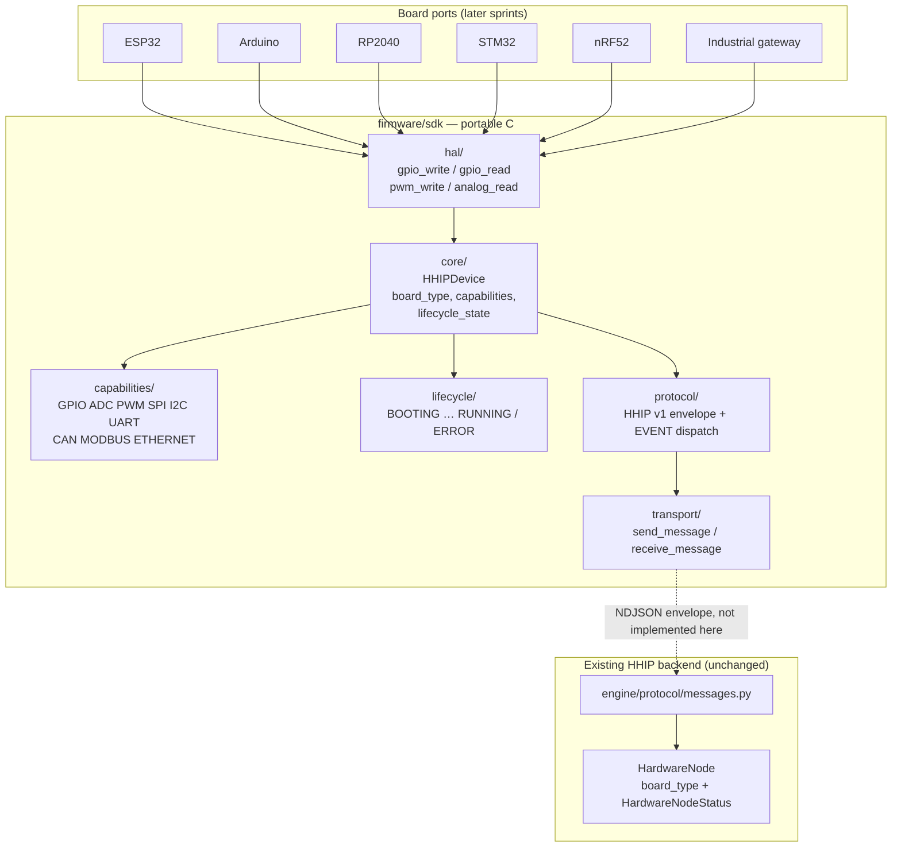

# HHIP Embedded SDK Architecture

Sprint 35 introduces a **hardware-neutral embedded SDK** so educational
boards, MCU firmware, and industrial controllers can become HHIP
compatible devices. It is not ESP32-only firmware, and it does not
replace the Python engine.

The wire format is HHIP Protocol Version 1, already defined by
`engine/protocol/messages.py`. This SDK ports that envelope into
portable C (C99, standard library + cJSON). It does not invent a new
message type set.

## Embedded SDK layout

```text
firmware/sdk/
├── core/            HHIPDevice + shared types
├── protocol/        Envelope encode/decode + dispatch (cJSON)
├── lifecycle/       Firmware-side state machine
├── capabilities/    Advertised I/O / bus registry
├── transport/       send_message / receive_message vtable (no wire)
└── hal/             gpio/pwm/analog interfaces (no drivers)
```



Board-specific code (pin maps, UART registers, WiFi sockets, BLE,
sensors, OTA) stays **out** of the SDK. A port fills the HAL and
transport vtables and uses `HHIPDevice` as the identity object.

## Hardware abstraction

`hhip_hal_t` is a function-pointer table:

| Interface | Role |
|---|---|
| `gpio_write(pin, value)` | Drive a digital output |
| `gpio_read(pin, *value)` | Sample a digital input |
| `pwm_write(pin, duty, freq_hz)` | Set PWM |
| `analog_read(pin, *value)` | Sample ADC |

There is no ESP-IDF, Arduino `digitalWrite`, STM32 HAL, or Pico SDK
call in this tree. Tests bind a mock HAL; production ports bind real
silicon later.

`HHIPDevice` is the identity the rest of HHIP already uses on the
host: `device_id`, `manufacturer`, `model`, `firmware_version`,
`board_type` (not `hardware_type` — same field as `HardwareNode`,
`PhysicalDevice`, and `HardwareDevice`), plus `capabilities` and
`lifecycle_state`.

## Protocol abstraction

Encoding and decoding are implemented now. The transport **under**
`send_message` / `receive_message` is not.

Envelope fields (identical to `Message.to_dict()`):

`version`, `message_id`, `type`, `source`, `target`, `sequence`,
`timestamp`, `payload`

`MessageType` constants match `engine/protocol/messages.py`:
`HELLO`, `HELLO_ACK`, `HEARTBEAT`, `READ`, `WRITE`, `STATE_UPDATE`,
`EVENT`, `ACK`, `ERROR`, `DISCONNECT`, `SYNC_REQUEST`,
`SYNC_RESPONSE`, `SYNC_CORRECTION_REQUEST`,
`SYNC_CORRECTION_RESPONSE`.

Two generations already on the wire share this envelope. The SDK
dispatch table accepts both; it does not pick a winner.

| Generation | Where | How it addresses an action |
|---|---|---|
| 1 | `firmware/esp32/hhip_device/`, `firmware/esp32/sync_agent/` | Top-level `type` (`HELLO`, `WRITE`, `SYNC_REQUEST`, …) |
| 2 | `firmware/hhip_agent/esp32/`, `firmware/hhip_agent/arduino_uno/` | `type=EVENT` and `payload.event` (`DEVICE_DISCOVERY`, `GPIO_STATE`, `GPIO_WRITE`) |

`hhip_protocol_encode` does **not** append a newline (same as
`encode_message()`). `hhip_send_message` frames NDJSON by appending
`\n`, matching every existing sketch.

JSON serialization uses vendored **cJSON 1.7.18** (MIT). That is the
one third-party exception; do not add others without an architecture
note. ArduinoJson stays in the legacy sketches until those sketches
are migrated onto this SDK.

## Lifecycle vs `HardwareNodeStatus` (open item)

Firmware states:

`BOOTING → DISCOVERING → CONNECTING → CONNECTED → SYNCING → RUNNING`
with `UPDATING` and `ERROR`.

Backend `HardwareNodeStatus`:

`CONNECTING` / `ONLINE` / `WAITING` / `OFFLINE` / `ERROR`.

These are **deliberately unmapped** in Sprint 35. The firmware
machine captures boot and update phases the backend never sees.
Unifying them here would guess which outbound message accompanies a
firmware transition and which inbound message should move a
`HardwareNode` to `ONLINE` vs `WAITING`. That mapping is a
**transport-layer concern** and belongs in the sprint that binds
`send_message` / `receive_message` to a real wire. Invalid firmware
transitions are rejected by an explicit table; they are never
silently applied.

## Supported controller strategy

Compile the SDK as portable C99 on any toolchain that can see the
headers and `cJSON.c`:

| Class | Examples | Port work (not in this sprint) |
|---|---|---|
| Educational MCU | Arduino Uno/Mega, ESP32, RP2040, STM32 Nucleo, nRF52 DK | HAL + UART/USB serial transport |
| Wireless SoC | ESP32, nRF52 | Same HAL; WiFi/BLE transport later |
| Industrial | STM32, gateways with CAN / Modbus / Ethernet | HAL + fieldbus transport; extra capabilities advertised now |

RAM-constrained ports (classic AVR Uno) may shrink
`HHIP_PAYLOAD_MAX` / `HHIP_ENCODE_MAX`. The protocol still needs a
JSON parser; cJSON is acceptable on ESP32/STM32/RP2040/nRF52. A
hand-rolled JSON path for Uno is a later size optimization, not a
second protocol.

Existing sketches under `firmware/esp32/` and `firmware/hhip_agent/`
remain the running agents. The SDK is the foundation they should
migrate onto; this sprint does not rewrite them.

## Future industrial extension

`CAN`, `MODBUS`, and `ETHERNET` are first-class SDK capabilities so a
gateway can advertise them in discovery later. The backend
`interfaces` vocabulary today is `gpio/adc/pwm/uart/spi/i2c`. A
device that advertises the extra three will have nothing to attach to
on the host. That is expected. Do not add backend pin/asset handling
for them until a dedicated industrial I/O sprint.

## What this sprint does not do

- No WiFi, BLE, sockets, or UART driver
- No ESP32-specific code, OTA, or sensors
- No GPIO hardware access
- No new envelope or `MessageType` values
- No change to backend simulation or `HardwareNode` status handling
- No lifecycle ↔ `HardwareNodeStatus` mapping

## Host tests

From `firmware/sdk/`:

```text
make test
```

Without `make`, the same flags:

```text
gcc -std=c99 -Wall -Wextra -Werror -g -O1 \
  -Icore -Ilifecycle -Icapabilities -Iprotocol -Iprotocol/cjson -Itransport -Ihal \
  -o build/test_sdk \
  core/hhip_device.c lifecycle/hhip_lifecycle.c capabilities/hhip_capabilities.c \
  protocol/hhip_protocol.c protocol/cjson/cJSON.c transport/hhip_transport.c \
  tests/test_sdk.c
./build/test_sdk
```

Requires a C99 compiler. The Makefile enables `-std=c99 -Wall -Wextra
-Werror` and turns on AddressSanitizer / LeakSanitizer when the
compiler can link them. On Windows GNU (MSYS2 mingw64) those runtimes
are not shipped; the test binary still fails if cJSON malloc/free
counts do not match.
